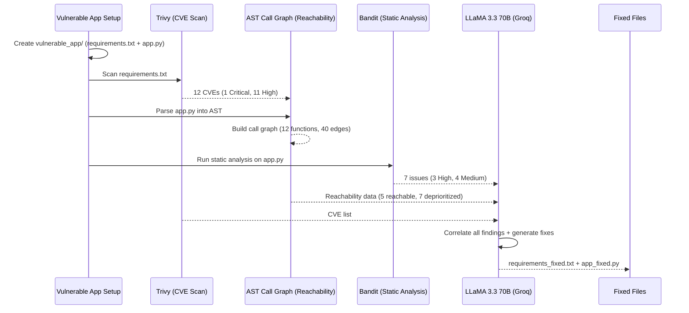

# AI-Native Security Analysis Pipeline

**Nullcon Workshop — Vulnerability Detection, Reachability Analysis & AI-Powered Remediation**

A complete, executable security analysis pipeline that scans dependencies for CVEs, builds a call graph for reachability analysis, runs static code analysis and uses an LLM to generate fixed code — all in a single notebook.


## Pipeline Architecture




## Prerequisites

| Requirement | Details |
|---|---|
| **Google Account** | Required to run the notebook in Google Colab |
| **Groq API Key** | Free key from [console.groq.com](https://console.groq.com) (used for LLM calls) |

No local installs are needed — the notebook installs all dependencies (Trivy, Bandit, Groq SDK) automatically inside Colab.


## Quick Start (Google Colab)

1. **Open the notebook in Google Colab**
   - Upload `nullcon_security_pipeline.ipynb` to [Google Colab](https://colab.research.google.com/), or open it directly from GitHub using `File → Open notebook → GitHub`.

2. **Get a free Groq API key**
   - Go to [console.groq.com](https://console.groq.com) and create an account.
   - Generate an API key from the dashboard.

3. **Paste your API key**
   - Find the cell that contains:
     ```python
     GROQ_API_KEY = 'gsk_YOUR_KEY_HERE'  # <── replace this
     ```
   - Replace `gsk_YOUR_KEY_HERE` with your actual key.

4. **Run All**
   - Click `Runtime → Run all` (or `Ctrl+F9`).
   - The entire pipeline runs in approximately **5 minutes**.

5. **Check the output**
   - `vulnerable_app/requirements_fixed.txt` — patched dependency versions
   - `vulnerable_app/app_fixed.py` — fully fixed source code
  

## Quick Start (Local)

### 1. Install Trivy

```bash
# macOS
brew install trivy

# Ubuntu/Debian
sudo apt-get install wget apt-transport-https gnupg lsb-release
wget -qO - https://aquasecurity.github.io/trivy-repo/deb/public.key | gpg --dearmor | sudo tee /usr/share/keyrings/trivy.gpg > /dev/null
echo "deb [signed-by=/usr/share/keyrings/trivy.gpg] https://aquasecurity.github.io/trivy-repo/deb generic main" | sudo tee /etc/apt/sources.list.d/trivy.list
sudo apt-get update && sudo apt-get install trivy
```

### 2. Install Python dependencies

```bash
pip install bandit groq pandas jupyter
```

### 3. Run the notebook

```bash
jupyter notebook nullcon_security_pipeline.ipynb
```

Then follow the same steps as above — paste your Groq API key and run all cells.


