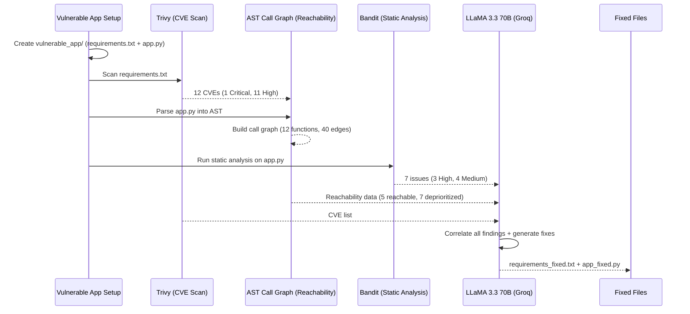

# AI-Native Security Analysis Pipeline

**Nullcon Workshop — Vulnerability Detection, Reachability Analysis & AI-Powered Remediation**

A complete, executable security analysis pipeline that scans dependencies for CVEs, builds a call graph for reachability analysis, runs static code analysis and uses an LLM to generate fixed code — all in a single notebook.

## Pipeline Architecture

